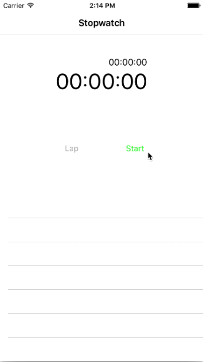

## Name : Arefin Nahid
## Roll : 2007050

# Stopwatch using Swift

Stopwatch is a Swift App that measures amount of time elapsed from a particular time. It highly mocks the stopwatch of Apple's offical App called Clock. This app supports functions such as lap record, time resume, and stopwatch reset.

## Screenshots

